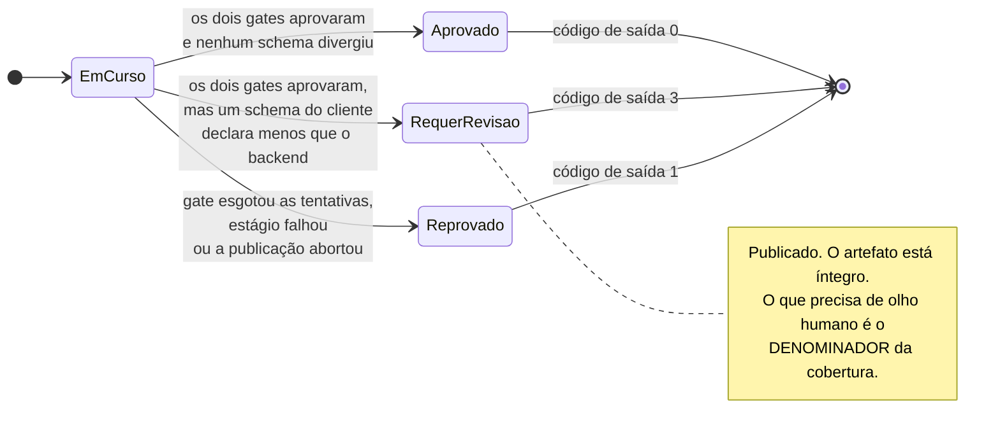

# Estados do recurso

Três estados, não dois. É aqui que o terceiro finalmente fica visível.

## Por que `REQUER_REVISAO` existe

"Preservei o contrato do cliente e ele diverge do que encontrei no backend" não é
nenhum dos outros dois.

**Não é reprovação:** os gates aprovaram, o artefato está íntegro e publicá-lo é o
certo. **E não pode ser aprovação:** o denominador da cobertura por campo encolheu
por um motivo que ninguém conferiu, então "100% coberto" ali significa "100% do que
o schema declara", que é menos do que o backend tem.

Quem decide entre atualizar o schema e aceitar a diferença é o dono do projeto. O
orquestrador **nunca** atualiza schema existente para fazer teste passar: seria
trocar a régua independente pela régua de quem está sendo medido.

## Por que o código de saída é 3, e não 0 nem 1

Um pipeline verde esconderia a revisão pendente. Um vermelho diria que algo
reprovou, quando nada reprovou e não há o que o modelo consertar. Num agendamento,
a diferença é entre "reenfileirar", "alertar alguém" e "abrir um chamado" — ver
[a referência da CLI](../referencia/cli.md).

Um recurso em `REQUER_REVISAO` responde `False` a `resultado.sucesso`, de propósito:
ele não terminou aprovado. Quem precisa distinguir revisão de reprovação lê
`estado`, não `sucesso`.
