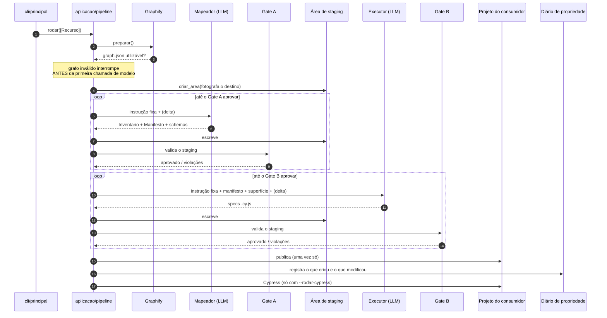

# Fluxo ponta a ponta

O que acontece entre `orquestrador --recurso pedidos` e o arquivo no disco de quem
nos contratou.

## O que o diagrama mostra e o texto não mostrava

**O projeto do consumidor aparece uma vez só, e depois dos dois gates.** Enquanto o
loop roda, cada tentativa reescreve a área de staging. O que uma tentativa ruim
destrói é a tentativa anterior — nunca o projeto de quem nos contratou.

**Os dois laços não compartilham nada.** O executor não recebe a exploração do
mapeador: recebe o manifesto, que é artefato em disco. É o princípio 1, e é ele que
permite matar e reinstanciar qualquer agente sem perda.

**A área de staging fotografa o destino antes de qualquer escrita.** É essa foto que
responde "este arquivo já era do consumidor?" na hora de gravar um schema — e é por
isso que o schema preexistente é preservado em vez de sobrescrito.
