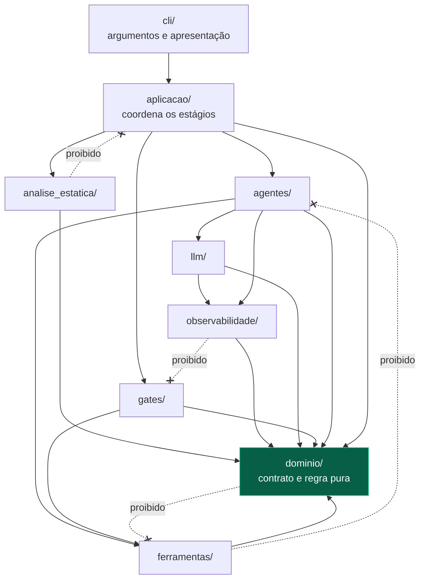

# Fronteiras

A seta aponta para baixo. Quem decide conhece quem executa, nunca o contrário.

As setas tracejadas são um recorte de `DIRECAO_PROIBIDA`, em
`tests/test_invariante_estrutura_do_codigo.py`.
**Este é o único diagrama do site com contraparte executável**: a matriz é fechada
sobre os nove pacotes, e importar na direção errada reprova a suíte.

## Por que uma seta invertida importa

Ela não quebra nada hoje. Ela transforma dois módulos independentes num par que
precisa ser lido junto para sempre — e, no caminho, impede testar a camada de baixo
sozinha e prepara o ciclo de import que ninguém vê chegar.

## `dominio/` não conhece ninguém

Nem quem produz o dado, nem quem decide sobre ele. `excecoes` é a única aresta
permitida. `Path` entra como **valor** — `Recurso.caminho_testes` é álgebra de
caminho, não acesso a disco —, e a diferença tem teste:
`test_dominio_nao_toca_no_disco` recusa import de `subprocess`, `os`, `io`,
`shutil` e rede, chamada de `open()`, e qualquer método de acesso a disco de `Path`.

## A armadilha que o teste da matriz existe para pegar

O valor de `DIRECAO_PROIBIDA` é comparado contra o **segundo componente** do módulo
importado. Proibir `"pipeline"` funcionava enquanto o módulo era
`orquestrador.pipeline`; no dia em que ele virou `orquestrador.aplicacao.pipeline`,
o valor deixaria de casar **em silêncio** e a proibição sumiria sem quebrar teste
nenhum. `test_direcao_proibida_so_cita_pacote_que_existe` transforma esse silêncio
em falha.
