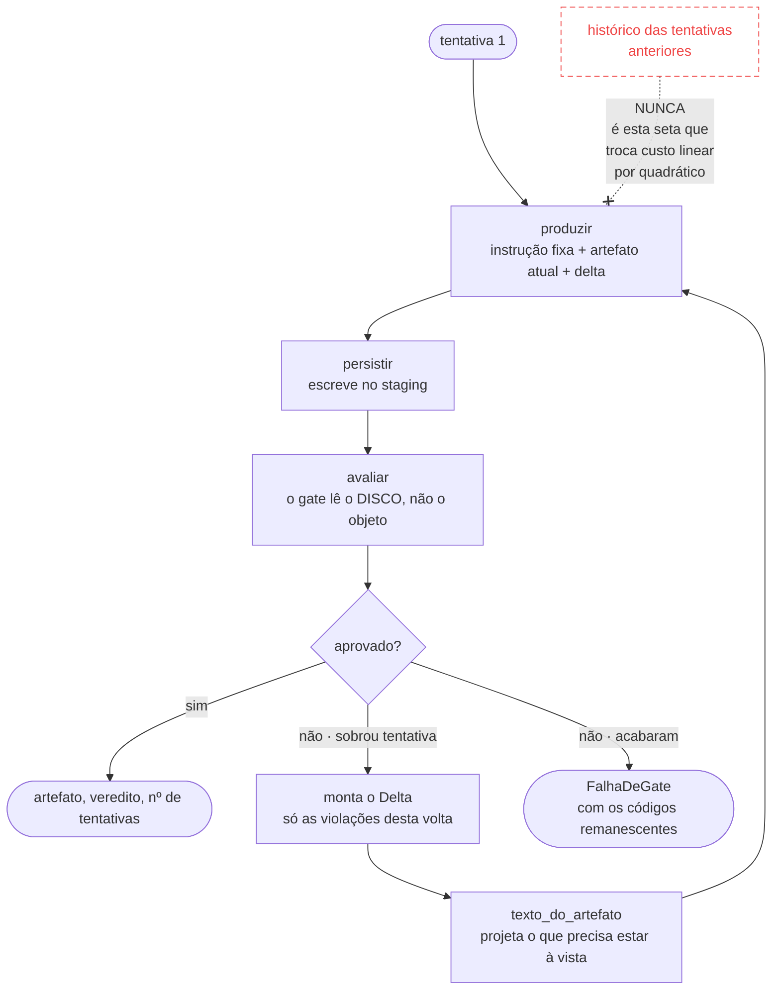

# O loop de reparo

O coração da arquitetura, e o único lugar onde o princípio 2 vira código:
`src/orquestrador/aplicacao/ciclo_de_reparo.py`.



A seta vermelha não existe no código. Ela está desenhada porque **o que é proibido
aqui é mais informativo do que o que é permitido**: qualquer pessoa que olhe este
laço vai querer, em algum momento, "só passar o contexto da tentativa anterior para
o modelo entender melhor". É essa tentação que o desenho nomeia.

## A fórmula

```
prompt da tentativa N = instrucao_fixa_do_estagio
                      + artefato_atual        (lido do disco)
                      + delta.violacoes       (só as desta volta)
```

Nada de mensagem anterior, resumo de tentativa, raciocínio ou "contexto extra". É
esse corte que torna o custo **linear** no número de tentativas em vez de
quadrático — e ele é verificável a partir do log, sem reexecutar nada: o evento
`estagio_tentativa` registra `caracteres_instrucao` (constante, linha de base) e
`caracteres_entrada`, e a entrada de um reparo tem de ser **menor** que a da
primeira tentativa.

`test_invariante_principio_2.py` fixa a fórmula; `test_e2e_dry_run.py::test_o_reparo_nao_cresce_o_contexto`
prova o efeito numa execução real.

## Por que persistir antes de avaliar

O gate é um script `.mjs` que lê arquivos. Avaliar o objeto em memória seria avaliar
outra coisa: a serialização é onde mora metade dos defeitos — chave em `camelCase`,
campo `null` onde a skill espera ausência, arquivo que não foi escrito porque o
caminho escapava do recurso.
