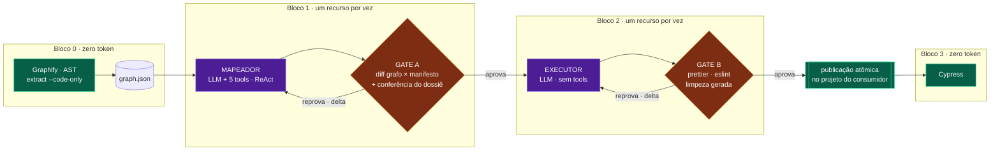

# Visão geral

Quatro blocos, um recurso por vez. Dois deles chamam um modelo; os outros dois não
chamam modelo nenhum, e é dessa assimetria que sai a promessa do projeto.

**Roxo cria, verde e laranja verificam.** É o princípio 4 desenhado: nenhum nó roxo
decide se a cobertura está completa, e nenhum nó roxo valida a saída de outro nó
roxo. Essa distinção é a coisa mais importante do diagrama, e era invisível no
bloco de texto que ele substituiu.

## Os dois defeitos, e quem pega cada um

Eles são diferentes, e só o segundo era o defeito de origem do projeto:

| Defeito | Quem pega |
| --- | --- |
| planejei N, entreguei menos que N | ninguém hoje — era o `validar-suite-gerada.mjs`, nos dois gates |
| o backend tem N, planejei menos que N | **diff grafo × manifesto** (`QAORQ-002`) |

O validador da skill enxergava apenas o projeto de testes, nunca o backend — limite
deliberado dela —, então nunca respondeu à segunda linha. O diff responde, e o
denominador dele sai do fonte do backend, sem passar por LLM nenhum. A primeira
linha ficou descoberta com o desacoplamento: é a maior perda registrada em
[Pendências](pendencias.md).

A segunda checagem do Gate A é a **conferência do dossiê** — evidência que aponta
arquivo e linha existentes, endpoint citado que está no gabarito, checklist
negativa respondida. Ela não substitui a linha que falta: prova que o mapeador leu
o backend, não que o executor escreveu o que foi planejado.

## O que cada bloco custa

O Bloco 0 e o Bloco 3 são determinísticos e não gastam token. Quase todo o custo
está no Bloco 1: é o mapeador que explora o backend, e é por isso que as tools dele
são instrumentadas uma a uma — ver [Artefatos de execução](../referencia/artefatos-de-execucao.md).
