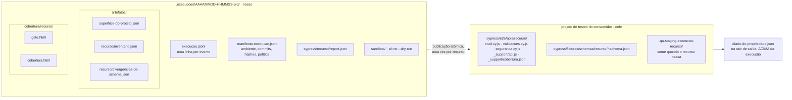

# Artefatos de execução

Cada execução escreve em dois lugares, e a separação entre eles é a coisa mais
importante desta página: **um é nosso, o outro é do cliente**.

## Por que o diário fica acima da execução

Ele responde *"este arquivo é nosso?"*, e essa pergunta **atravessa execuções**. Um
spec que criamos na terça e que alguém editou na quarta não é nosso para apagar na
quinta — e é o diário que sabe disso.

## O staging só sobrevive quando o recurso falha

É o único diretório nosso que fica **dentro** do projeto do consumidor. Quando
sobra, ou está vazio — e aí é lixo, e some — ou tem o artefato reprovado, e aí o
evento `staging_mantido` diz onde ele está. Artefato reprovado não é apagado por
padrão: é o que se inspeciona para entender a falha.

## O que **não** vira artefato

O texto que uma tool devolveu. O `execucao.jsonl` grava `caracteres` e o prefixo
`ERRO:`, nunca o conteúdo — ver
`tests/test_observabilidade_medidas.py`.
O log mede; ele não transcreve.
